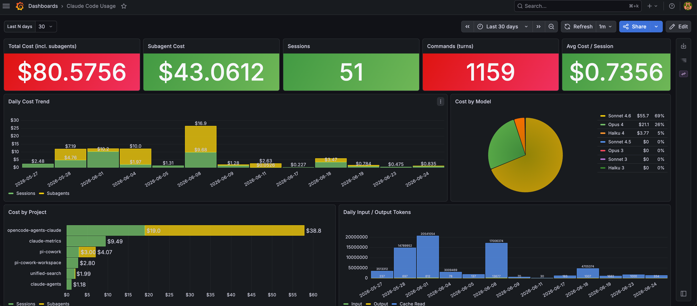

# claude-metrics

Grafana dashboard for accurate Claude Code token and cost tracking, backed by SQLite.



## Start

```bash
docker compose up -d
```

Grafana: http://localhost:3000 (admin / admin)

First start downloads the `frser-sqlite-datasource` plugin — takes ~30s extra.

## Stop

```bash
docker compose down
```

Session data lives in `metrics/data/sessions.db` inside the project — it survives container restarts. To wipe everything:

```bash
docker compose down -v
rm -rf data/
```

## How it works

Claude Code fires a `Stop` hook at the end of every session. The hook runs
`scripts/push-metrics.sh` (in `opencode-agents-claude`), which:

1. Reads the session JSONL from `~/.claude/projects/`
2. Deduplicates assistant messages by ID
3. Writes one row to `sessions` (aggregated totals) and one row per assistant
   message to `turns` (per-command detail)
4. Derives a human-readable session name from the first user message

## Environment variables

| Variable | Default | Description |
|---|---|---|
| `CLAUDE_METRICS_PROJECT` | `basename $PWD` | Project label |
| `CLAUDE_SESSION_NAME` | _(first user message)_ | Override session name |
| `CLAUDE_SESSIONS_DB` | `metrics/data/sessions.db` | SQLite path |

## Database schema

### `sessions`

| Column | Type | Description |
|---|---|---|
| `id` | TEXT PK | Session UUID |
| `name` | TEXT | Human name (first user message, ≤80 chars) |
| `project` | TEXT | Project directory |
| `model` | TEXT | Last model used |
| `started_at` | TEXT | ISO timestamp — first message |
| `ended_at` | TEXT | ISO timestamp — last message |
| `duration_s` | INTEGER | Wall-clock seconds |
| `input_tokens` | INTEGER | Total input tokens |
| `output_tokens` | INTEGER | Total output tokens |
| `cache_read_tokens` | INTEGER | Total cache reads |
| `cache_creation_tokens` | INTEGER | Total cache writes |
| `cost_usd` | REAL | Estimated cost (Anthropic list price) |
| `turns` | INTEGER | User turn count |
| `first_message` | TEXT | First user message (≤120 chars) |

### `turns`

One row per unique assistant response within a session.

| Column | Type | Description |
|---|---|---|
| `id` | TEXT PK | Assistant message UUID |
| `session_id` | TEXT | FK → sessions.id |
| `session_name` | TEXT | Denormalised session name |
| `project` | TEXT | Project |
| `model` | TEXT | Model for this response |
| `timestamp` | TEXT | ISO timestamp |
| `turn_index` | INTEGER | 0-based position within session |
| `input_tokens` | INTEGER | Input tokens this turn |
| `output_tokens` | INTEGER | Output tokens this turn |
| `cache_read_tokens` | INTEGER | Cache reads this turn |
| `cache_write_tokens` | INTEGER | Cache writes this turn |
| `cost_usd` | REAL | Cost for this turn |

## Cost calculation

Each assistant turn's cost is computed from the token counts reported by the API using Anthropic list prices:

```
cost = (input_tokens    × input_price/M)
     + (output_tokens   × output_price/M)
     + (cache_read_tokens     × cache_read_price/M)
     + (cache_creation_tokens × cache_write_price/M)
```

Prices per million tokens (as of June 2026):

| Model | Input | Output | Cache read | Cache write |
|-------|------:|-------:|-----------:|------------:|
| Claude Opus 4 / 3 | $15.00 | $75.00 | $1.50 | $18.75 |
| Claude Sonnet 4 / 3 | $3.00 | $15.00 | $0.30 | $3.75 |
| Claude Haiku 4 | $0.80 | $4.00 | $0.08 | $1.00 |
| Claude Haiku 3 | $0.25 | $1.25 | $0.03 | $0.30 |

The model is matched by prefix (e.g. `claude-sonnet-4-6` matches `claude-sonnet-4`). Unrecognised models fall back to Sonnet 4 pricing.

**Session cost** is the sum of all turn costs within that session.

**Total Cost (incl. subagents)** shown in the dashboard is the sum of session costs plus all subagent costs — subagents run in separate transcript files and are tracked in the `subagents` / `subagent_turns` tables. The **Subagent Cost** stat shows just the subagent portion, so `Total = Sessions + Subagents`.

Cache reads are significantly cheaper (10× less than input) — high cache-read ratios indicate effective prompt caching and lower real-world cost for repeated context.

## Ad-hoc analysis

```bash
# Cost last 7 days
sqlite3 ~/claude-metrics/sessions.db \
  "SELECT ROUND(SUM(cost_usd),4) FROM sessions WHERE started_at >= datetime('now','-7 days')"

# Most expensive sessions
sqlite3 ~/claude-metrics/sessions.db \
  "SELECT name, project, printf('\$%.4f', cost_usd) FROM sessions ORDER BY cost_usd DESC LIMIT 10"

# Costliest individual commands
sqlite3 ~/claude-metrics/sessions.db \
  "SELECT session_name, turn_index+1, model, printf('\$%.5f', cost_usd) FROM turns ORDER BY cost_usd DESC LIMIT 20"

# Weekly spend
sqlite3 ~/claude-metrics/sessions.db \
  "SELECT strftime('%Y-W%W', started_at), printf('\$%.4f', SUM(cost_usd)) FROM sessions GROUP BY 1 ORDER BY 1"
```

## Dashboard panels

| Section | Panel |
|---|---|
| **Overview** | Total cost, sessions, commands, avg cost/session |
| **Trends** | Daily cost bar, cost by model pie |
| **Breakdown** | Cost by project, daily input/output tokens |
| **Sessions** | Full session table with name, model, tokens, cost |
| **Commands** | Per-turn table: time, session, model, token counts, cost |
| **Analysis** | Top 10 expensive sessions, cost-per-turn distribution, avg tokens by model, cache efficiency |
